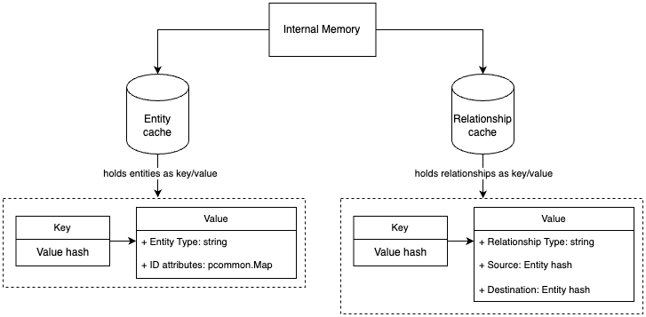

# Storage

The storage is used to track relationship lifetime. If the relationship was not seen for longer than the set interval,
an event is sent to the SolarWinds Observability SaaS to delete the relationship.

The connector can be configured to use storage by enabling `expiration_policy` in the configuration file.

The `cache_configuration` section is described in the [Cache Configuration](#cache-configuration) section.
```yaml
expiration_policy:
    enabled: true
    interval: 5s # TTL interval for relationship
    cache_configuration:
        max_capacity: 1000000 # Maximum number of relationships and entities in the cache
        ttl_cleanup_interval: 10s # Interval for periodic cleanup of expired relationships. Minimum is 1s.
```

## Events
### Incoming Events
The storage reacts to Relationship Update and Delete events.
- On Relationship Update event:
  - The entities of the relationship are either created or their TTL is reset in the entity cache.
  - The relationship is created or its TTL is reset in the relationship cache.

- On Relationship Delete event:
  - The relationship is removed from the relationship cache.
  - The entities of the relationship are not actively removed, they will expire after their TTL.
  
The storage does not react to Entity Update events, as it does not need to track entity updates, if we
do not support entity expiration.

### Outgoing Events
The storage sends Relationship Delete events when:
- The relationship is evicted from the relationship cache due to TTL expiration.

## Internal Storage
Internal storage uses two caches, one for entities and one for relationships.
Both caches are implemented using [ristretto cache](https://github.com/hypermodeinc/ristretto).

### Entity Cache
The entity cache is used to store entities that were seen by the connector. This cache stores entity type
and ID attributes of the entity. We need to store entity IDs to be able to send valid delete event to the SWO.
If we omitted entity cache, we would need to store IDs of each entity duplicate in each relationship of relationship cache.
This way, each actual entity is stored only once in the entity cache.

The attributes (not IDs) does not need to be stored, the delete events do not require them.

Entity cache uses TTL to prevent from storing expired entities in the cache. Thus, the TTL of each item
and cleanup interval can be longer than the TTL of relationships.

Additionally, it provides the ability to support entity expiration events in the future.

### Relationship Cache
The relationship cache is used to store relationships between entities. Each relationship is represented by a composite key,
which consists of the hash of source entity, hash of target entity, and relationship type.

When relationship is evicted from the cache:
1. Get source entity by hash.
2. Get destination entity by hash.
3. If any of the entities is not found, the storage does not send delete event to the SWO.
4. Creates delete event that contains entity types and their IDs, along with relationship type.




### Ristretto Cache
Ristretto cache has an TTL option we use to remove relationships and entities that were not seen for a certain period of time.

The eviction handler (after TTL expiration of a relationship) is not triggered immediately, but after the next TTL cleanup interval.
TTL cleanup is done sequentially for all relationships in the cache.

#### Cache Configuration
The cache configuration is set in the `cache_configuration` section of the connector's configuration file.
It provides options to set the maximum capacity of the cache and the TTL cleanup interval. 

The connector uses the default settings of ristretto cache, only required options are set when creating the cache.
